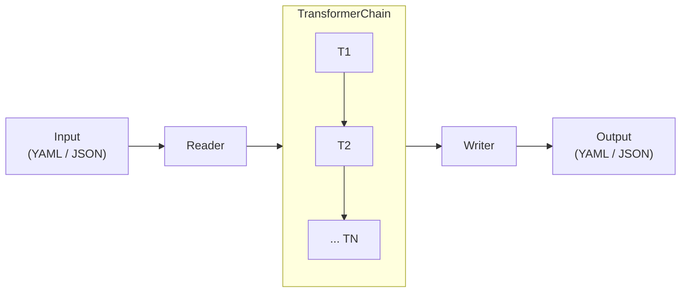

# Spec Transformer

[](https://www.npmjs.com/package/@expediagroup/spec-transformer)
[](LICENSE)
[](https://github.com/ExpediaGroup/spec-transformer/actions)

A composable pipeline for transforming OpenAPI 3.0 specifications.

- Strip unwanted HTTP headers before publishing API docs
- Prepend path prefixes for API gateway routing
- Consolidate tags for unified documentation portals
- Auto-generate `oneOf` discriminator patterns for polymorphic schemas
- Convert OpenAPI specs to Postman Collections

Available as a TypeScript library and a CLI.

## Architecture



## Transformers

| Transformer | What it does |
| --- | --- |
| `HeaderRemovalTransformer` | Removes unwanted HTTP headers from operations and components. Resolves `$ref` references. Case-insensitive matching. |
| `EndpointTransformer` | Prepends a path prefix to all endpoints. Auto-extracts from the first server URL if omitted. |
| `TagsSettingTransformer` | Replaces all operation and top-level tags with a single target tag. |
| `OperationIdsToTagsTransformer` | Uses each operation's `operationId` as its tag. |
| `OneOfSettingTransformer` | Auto-generates `oneOf` arrays for polymorphic schema hierarchies using discriminator mappings. |
| `PostmanTransformer` | Converts an OpenAPI spec into a Postman Collection v2.1. |

## Installation

```bash
npm install @expediagroup/spec-transformer
```

## Library Usage

### Single transformer

```typescript
import {
  COMMON_UNWANTED_HEADERS,
  HeaderRemovalTransformer,
  TransformerChain,
  YamlReader,
  YamlWriter,
} from '@expediagroup/spec-transformer';

const specs = '...'; // OpenAPI spec as a YAML string

const chain = new TransformerChain([
  new HeaderRemovalTransformer(COMMON_UNWANTED_HEADERS),
]);

const result = chain.transform(specs, new YamlReader(), new YamlWriter());
console.log(result);
```

`COMMON_UNWANTED_HEADERS` removes: `accept`, `accept-encoding`, `user-agent`, `authorization`, `content-type`.

### Chaining multiple transformers

```typescript
import {
  COMMON_UNWANTED_HEADERS,
  EndpointTransformer,
  HeaderRemovalTransformer,
  TagsSettingTransformer,
  TransformerChain,
  YamlReader,
  YamlWriter,
} from '@expediagroup/spec-transformer';

const chain = new TransformerChain([
  new HeaderRemovalTransformer(COMMON_UNWANTED_HEADERS),
  new TagsSettingTransformer('my-api'),
  new EndpointTransformer('/v2'),
]);

const result = chain.transform(specs, new YamlReader(), new YamlWriter());
```

### In-memory objects

Use `transformRecord()` when you already have a parsed spec object:

```typescript
import {
  COMMON_UNWANTED_HEADERS,
  HeaderRemovalTransformer,
  TransformerChain,
} from '@expediagroup/spec-transformer';

const spec = { openapi: '3.0.0', paths: { /* ... */ } };

const chain = new TransformerChain([
  new HeaderRemovalTransformer(COMMON_UNWANTED_HEADERS),
]);

const result = chain.transformRecord(spec);
```

## Before / After Examples

### Header Removal

Three header parameters go in - only the custom one survives:

**Before:**

```yaml
paths:
  /pets:
    get:
      parameters:
        - name: accept
          in: header
        - name: X-Request-ID
          in: header
        - name: content-type
          in: header
```

**After** (with `COMMON_UNWANTED_HEADERS`):

```yaml
paths:
  /pets:
    get:
      parameters:
        - name: X-Request-ID
          in: header
```

### OneOf Discriminator

A `$ref` pointing to a parent schema with a discriminator is replaced with a `oneOf` array of its leaf types:

**Before:**

```yaml
paths:
  /test:
    post:
      requestBody:
        content:
          application/json:
            schema:
              $ref: "#/components/schemas/PaymentMethod"
```

**After** (given `PaymentMethod -> CreditCard, PayPal` and `CreditCard -> Visa, Mastercard` hierarchies):

```yaml
paths:
  /test:
    post:
      requestBody:
        content:
          application/json:
            schema:
              oneOf:
                - $ref: "#/components/schemas/PayPal"
                - $ref: "#/components/schemas/Mastercard"
                - $ref: "#/components/schemas/Debit"
                - $ref: "#/components/schemas/Credit"
```

## CLI Usage

```bash
npx @expediagroup/spec-transformer --help
```

### Options

| Flag | Description |
| --- | --- |
| `--input [path]` | Input file path |
| `--inputFormat [value]` | Input format: `json` or `yaml` (default: `yaml`) |
| `--output [path]` | Output file path |
| `--outputFormat [value]` | Output format: `json` or `yaml` (default: `yaml`, or `json` when `--postman` is used) |
| `--headers [list]` | Remove specified headers (comma-separated), or common headers if no value given |
| `--tags [value]` | Replace all tags with the given tag |
| `--endpoint [prefix]` | Prepend a path prefix, or auto-extract from the first server URL |
| `--oneOf` | Generate `oneOf` arrays for polymorphic schemas |
| `--postman` | Convert to Postman Collection format |
| `--operationIdsToTags` | Use operation IDs as tags |
| `--defaultStringType [value]` | YAML string quoting style: `PLAIN` (default) or `QUOTE_SINGLE` |

### Examples

```bash
# Remove common headers
npx @expediagroup/spec-transformer --input api.yaml --output clean.yaml --headers

# Remove specific headers
npx @expediagroup/spec-transformer --input api.yaml --output clean.yaml --headers "authorization,x-api-key"

# Chain transformations
npx @expediagroup/spec-transformer --input api.yaml --output out.yaml --headers --tags my-api --endpoint /v2

# Convert to Postman Collection
npx @expediagroup/spec-transformer --input api.yaml --output collection.json --postman
```

## Supported Formats

| Format | Reader | Writer |
| --- | --- | --- |
| YAML | `YamlReader` | `YamlWriter` |
| JSON | `JsonReader` | `JsonWriter` |

## Development

```bash
npm install
npm run build
npm test
```

Tests enforce a 90% coverage threshold across statements, branches, functions, and lines.

## License

This project is licensed under the [Apache License, Version 2.0](LICENSE).

---

## Development Team
- [Mohammad Noor Abu Khleif](https://github.com/mohnoor94)
- [Osama Salman](https://github.com/osama-salman99)
